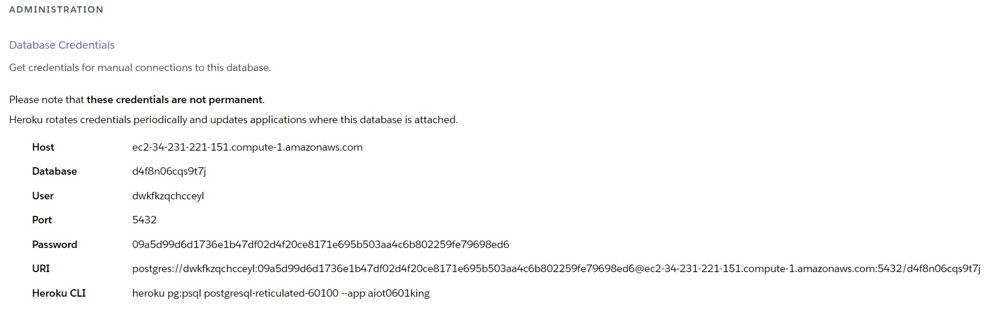
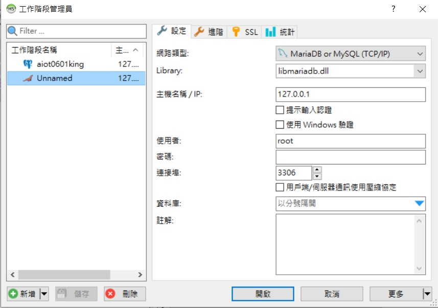
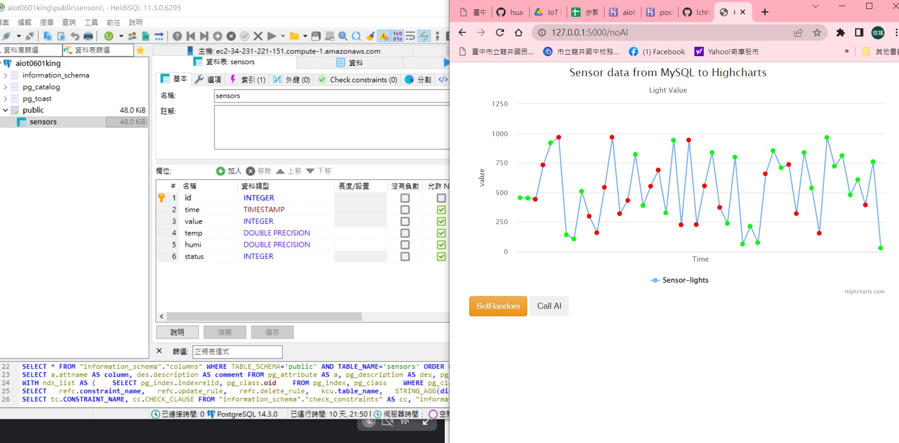
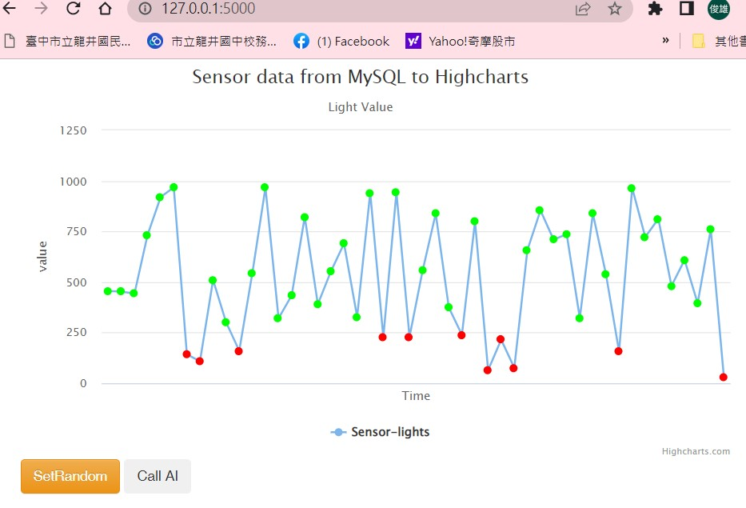
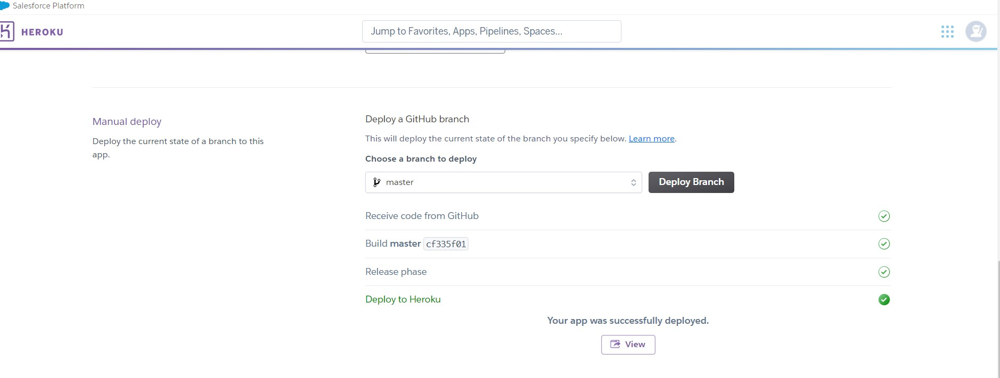
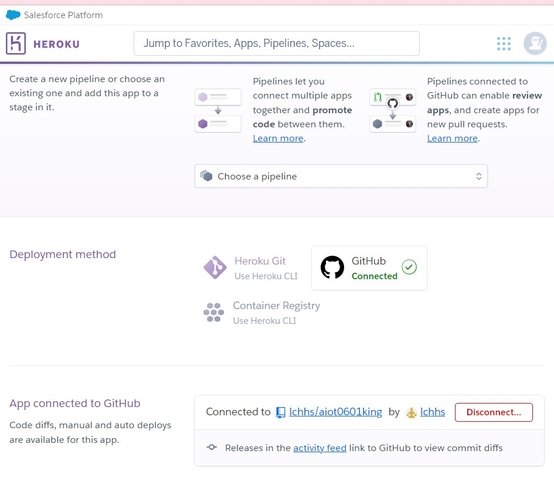
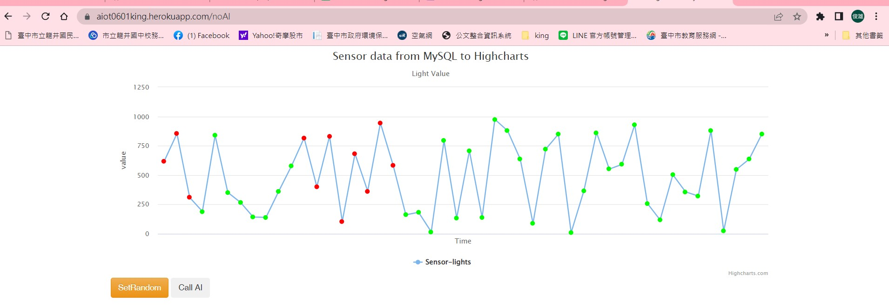
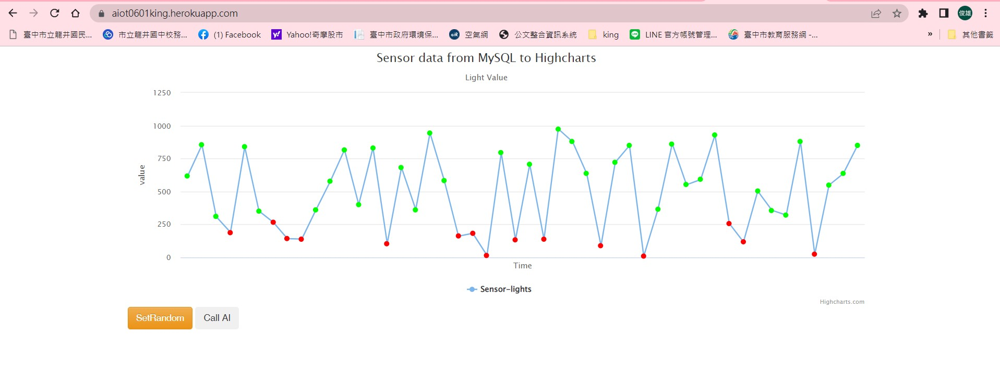

# AIoT Github

## Lecture 15: IoT Flask Web (deploy to heroku)
### Author : Lin Chun-hsiung

### step 0 :
* 註冊 Heroku, github 請下載 HeidiSQL, VS code
* github, heroku account setup
* download HeidiSQL, VS code
### step 1 : Clone this github
* clone https://github.com/huanchen1107/aiot0529 (initial setup)
* delete .git 管理者, folder ./aiot0529 下面的資料都搬上一層
* git remote to new repository aiot0601
### step 2 : install some package
* If you want to test locally, you need to install the following packages. (That is the same thing in the requirements.txt)

```python
pip install gunicorn Flask==2.0.1 Jinja2==3.0.1 psycopg2 sklearn pandas numpy 
```

### step 3: add an heroku postgredb

* register heroku account
* go to dashboard
* new an app
* go to resource and add-on an Heroku postgredb

### step 4: login to heroku pstgredb using HeidiSQL


```sql
myserver ="<fill-in-Heroku-Postgredb-DB-sever>"
myuser="<fill-in-Heroku-Postgredb-DB-user>"
mypassword="<fill-in-Heroku-Postgredb-DB-pwd>"
mydb="<fill-in-Heroku-Postgredb-DB-db>"

```
### step 5: import postgredb (in db/postgre.db)



### step 6: setting db in app.py



```sql
myserver ="<fill-in-Heroku-Postgredb-DB-sever>"
myuser="<fill-in-Heroku-Postgredb-DB-user>"
mypassword="<fill-in-Heroku-Postgredb-DB-pwd>"
mydb="<fill-in-Heroku-Postgredb-DB-db>"

```
### step 7: testing locally by running python app.py
local

SetRandom



CallAI




### step 8: deploy to github (new private github repositoy)

delete .git and git remote add origin master github.com/xxxxx



### step 9: Heroku deploy from github



### step 10: Complete

https://aiot0601king.herokuapp.com/ 
SetRandom



CallAI




